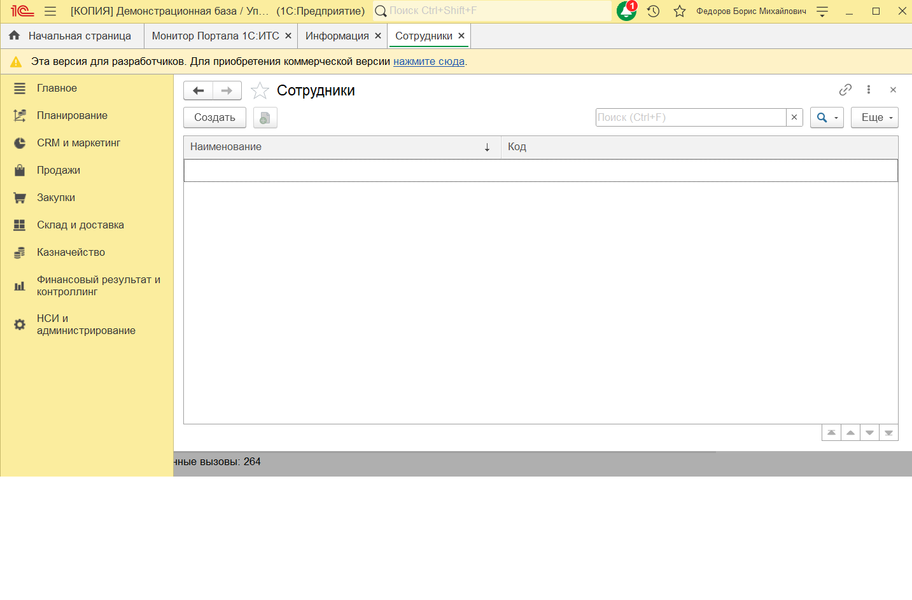
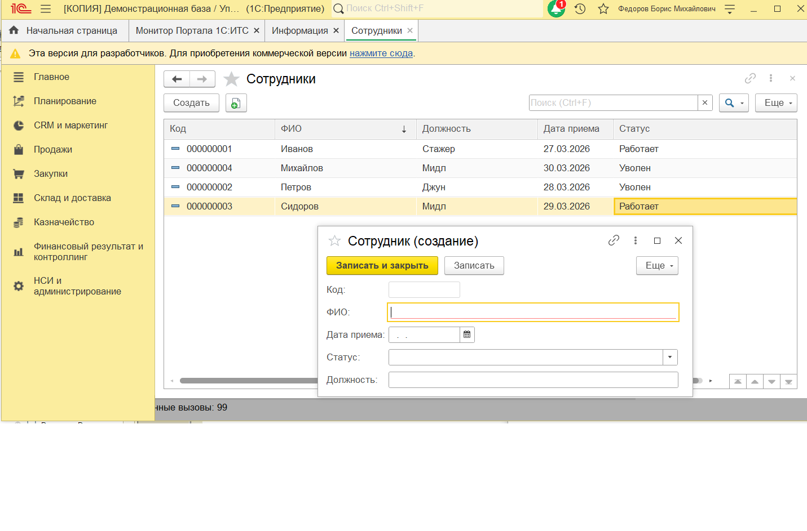
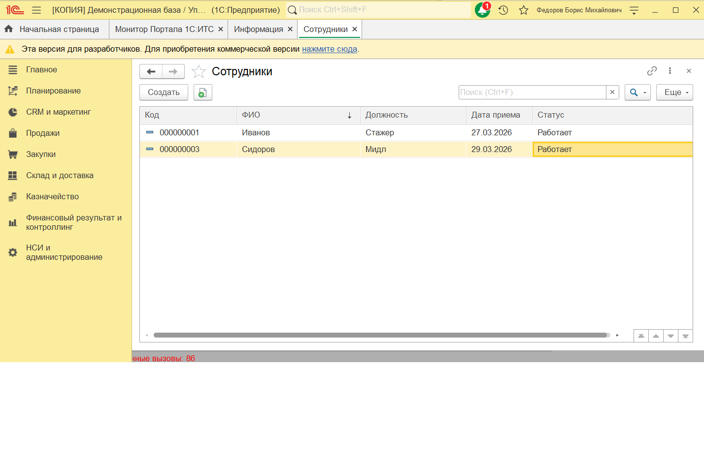
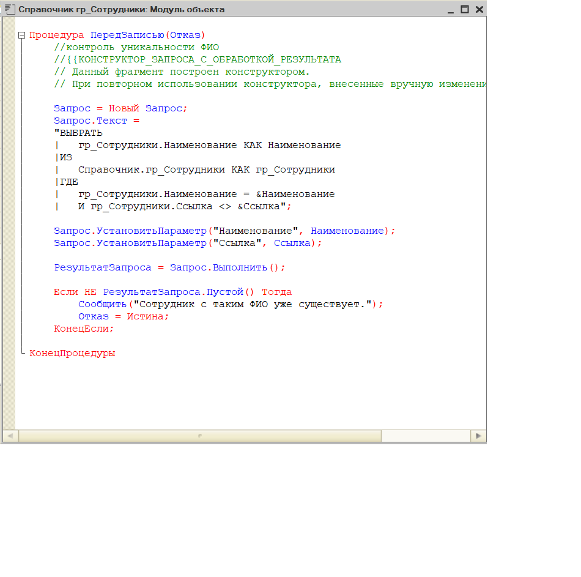

# Задача 1.1 — Справочник «Сотрудники»

## Условие
Создать справочник сотрудников с реквизитами: ДатаПриёма, Статус (Работает/Уволен), Должность.
Реализовать отбор по статусу в форме списка и контроль уникальности ФИО.

## Решение
- Создан справочник `гр_Сотрудники`
- Добавлены реквизиты (скриншот `1.1_after.png`)
- Проверка дублей в `ПередЗаписью` (скриншот `1.1_code.png`)

## Как проверить
1. Открыть справочник «гр_Сотрудники»
2. Добавить двух сотрудников с одинаковым ФИО — будет ошибка
3. Выбрать в отборе «Только работающие» — уволенные пропадут

## Скриншоты
- Было: 
- Стало: 
- Стало: 
- Код: 